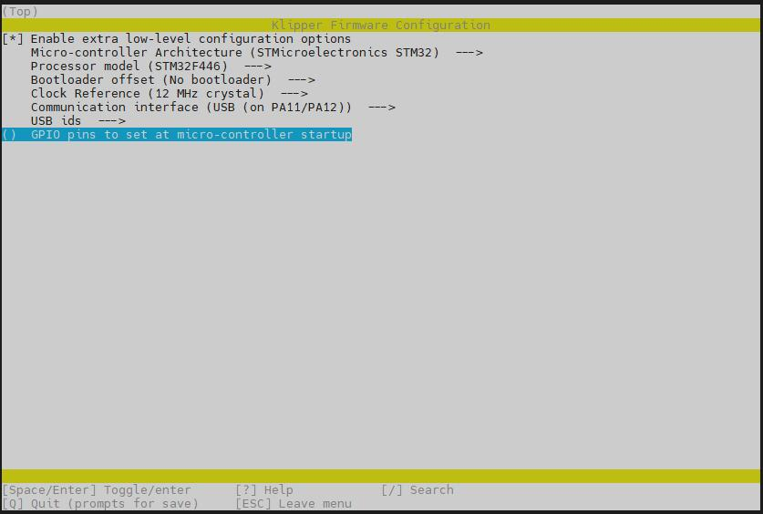
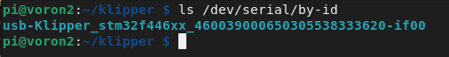

# Cheetah v3 Klipper Firmware

The firmware installation process for the Fysetc Cheetah v3 MCU.

### Prerequisites

* Klipper must be installed onto the Raspberry Pi
* It is desirable, though not strictly necessary to have a small sdcard available
* Even if you intend to power your Pi with the Cheetah, during this flashing process, you will find it far more convenient to power your Pi from some other source, such as a regular USB power supply
* Voron Design recommends using USB to control the Cheetah, which simply requires connecting a USB-A to USB-C cable between the Cheetah and Pi.  If you prefer a UART connection, please consult the fysetc documentation for the necessary configuration adjustments.

### Build Firmware Image

* Login to the Raspberry Pi via ssh
* Run the following:

   ```
   sudo apt install make
   cd ~/klipper
   make clean
   make menuconfig
   ```

* In the menu structure there are a number of items to be selected.
  * Select "Enable extra low-level configuration options"
  * Set the micro-controller architecture is set to `STMicroelectronics STM32`
  * Set the Processor model to `STM32F446`
  * Set the Bootloader offset to `No bootloader`
  * Set the Clock Reference to `12 MHz crystal`
  * Set the Communication interface to `USB (on PA11/PA12)`  (note: see Fysetc documentation if you intend to use UART rather than USB)

   

* Once the configuration is selected, press `q` to exit, and "Yes" when  asked to save the configuration.

* Run the command `make`
* The `make` command, when completed, creates a firmware file **klipper.bin** which is stored in the folder `/home/pi/klipper/out`.  


### Firmware Installation
#### DFU Firmware Install

* Requires a USB connection
* Requires the installation of an extra jumper on the Cheetah
* Does NOT require a microSD card

1. Power off the Cheetah if powered on
2. Install a jumper between 3.3V and B0 (Move jumper from B0 and G)
3. Connect Cheetah & Pi via USB
4. Power on Cheetah via the main PSU
5. From your ssh session, run `cd ~/klipper` to make sure you are in the correct directory
6. Run `lsusb`. and find the ID of the DFU device.
7. Run `make flash FLASH_DEVICE=1234:5678`, replacing 1234:5678 with the ID from the previous step
8. Power off the Cheetah
9. Remove the jumper from 3.3V/B0 and replace to B0 and G
10. Power up the Cheetah
11. You can confirm that the flash was successful by running `ls /dev/serial/by-id`.  If the flash was successful, this should now show a klipper device (Save this ID), similar to:
 
   

   (note: this test is not applicable if the firmware was compiled for UART, rather than USB)
   
12. You can now power down both the Pi (choosing shutdown from the Mainsail UI) and Cheetah
13. Now connect the Pi to the cheetah with both USB and the multi-pin cable supplied, but remove the power supply you used to power the Pi for the steps above
14. Power up the V0.2
15. You should now be able to connect to Mainsail via a browser
16. You now need to upload the printer.cfg from the Fysetc Github
17. Once uploaded, edit the printer.cfg with the ID you saved from step 11
18. Save and Restart
19. You should now be connected to the Cheetah

   
